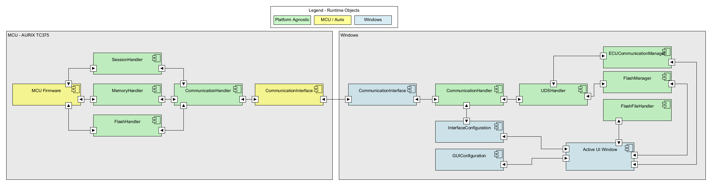

## Information

The architecture and runtime objects diagrams for the AMOS Project Update Flash Boot Loader was created with the Tool [UMLet](https://www.umlet.com/) Version 15.1.

### Software Architecture

## Software Runtime Objects

