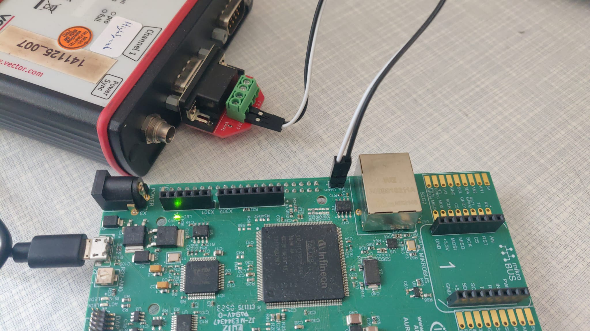

# Getting Started

A quick description how to set up the hardware and run the project.
Further documentation about the build process can be found in [bootloader build](../MCU_Aurix/Readme.md) and in [GUI build](../WINDOWS_GUI/Readme.md).

## Install Dependencies

### AURIX&trade; TC375 lite kit
* Installation of [Aurix Development Studio](https://www.infineon.com/cms/en/product/promopages/aurix-development-studio/)


### GUI
* Installation of [QT 6.8.0 Open Source](https://www.qt.io/download-qt-installer-oss) with MSVC2019 64 and cmake. Under LGPLv3 license which content can be accessed in the LGPLv3 file.
* Install MSVC2022 (remember to add the compiler to the system variable PATH) and Microsoft SDK using e.g. [Visual Studio](https://visualstudio.microsoft.com/) 
* Install [cmake](https://cmake.org/)

### CAN

- Vector Driver for [CancaseXL](https://www.vector.com/us/en/download/vector-driver-setup-for-windows-10-and-11/)
- [XL Driver Library](https://www.vector.com/us/en/download/xl-driver-library-203014/)
- [Canoe](https://www.vector.com/de/de/download/canoe-full-installer-14-sp3-windows/)

## Useful Tools

- Aurix [Memtool](https://softwaretools.infineon.com/tools/com.ifx.tb.tool.infineonmemtool) to read memory from the Aurix dev kit


## Wire up CAN bus

- connect the cable for the serial port from the Cancase to the Aurix Microcontroller. On the Aurix TC375 the CAN pins are right next to the ethernet port. Make sure that the high and low pins are connected by the same cable e.g. the white cable connects high from the adapter on the Cancase to the high pin on the board.

- connect the microcontroller via a micro USB cable to your computer
- connect the Cancase via a USB cable to your computer

## How to Run

- select Cancase in Can Hardware Manager (comes bundled with Vector Drivers) or similar tool
- either build the bootloader and GUI yourself see [bootloader build](../MCU_Aurix/Readme.md) and [GUI build](../WINDOWS_GUI/Readme.md) or use the binaries from the [latest release](https://github.com/amosproj/amos2024ss07-updating-flash-boot-loader/releases/latest)

### GUI
- extract the zip file from the release
- to run the GUI the vxlapi.dll and vxlap64.dll are needed from the Vector Driver Library: either copy those files next to the WINDOWS_GUI.exe or add them to your path (`PATH=%PATH%;C:\Users\Public\Documents\Vector\XL Driver Library 20.30.14\bin`)
- powershell: `call "WINDOWS_GUI.exe"`

### Bootloader

- extract the elf file from the latest release
- flash the elf file to the Aurix MCU
- the Flashing tool from the Aurix IDE can be used for this
```
C:\Infineon\AURIX-Studio-1.9.20\tools\AurixFlasherSoftwareTool_v1.0.8\AurixFlasher.exe -elf MCU_Aurix.elf
```
- or [build and flash it yourself](../MCU_Aurix/Readme.md) in the Aurix IDE

## GUI Walkthrough

- the Licences can be found in the upper left corner
- the GUI is separated in different sections: ECU, File and Communication

### ECU

- currently connected Microcontrollers are listed here in a table
- to refresh the currently connected microcontrollers, press the `refresh` button
- by selecting a row in the table a microcontroller is selected to perform all operations with
- for a selected microcontroller the current status is shown below the table: green means connected and red connection lost
- to reset the selected MCU press the `reset` button
- for flashing a file must be choosed through the Flash File section
- to flash the file to the selected MCU press the `flash` button

### Flash File

- press choose file and select a file for flashing in the file explorer
- the metada of the file are listed underneath, like version, validity, extension, etc.

### Communication

- the communication protocol with the MCU can be choosen, the default is CAN
- A log of the last CAN messages since opening the GUI is also shown in this section
- to clear the log press `clear console`