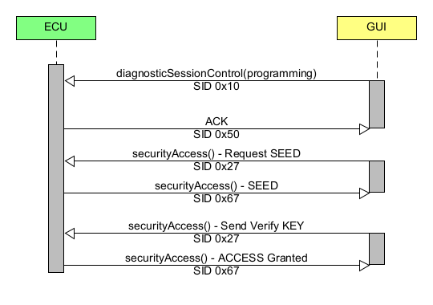

# UDS Communication Documentation for Flashbootloader

This document describes the concept of the UDS communication that is used for this project. Mainly there is only a suitable subset of the UDS protocol implemented so that the bootloader stays as simple as possible. Furthermore this means that adaptions were made if necessary for this project.

## CAN and CAN FD Basics
CAN and CAN FD is used as main communication protocol. There are some further readings found under [CAN FD Wikipedia](https://en.wikipedia.org/wiki/CAN_FD)
and [CAN Bus Wikipedia](https://en.wikipedia.org/wiki/CAN_bus). First of all the communication in general is defined in the following section.

>The identification of the different ECUs and the Flashbootloader GUI is considered as following:
> - The extended frame format with 29 bit identifier is used (0x1FFFFFFF - 0001 1111 1111 1111 1111 1111 1111 1111)
> - The identifier mask is 0x0F24 FFFF - 0 1111 0010 0100 1111 1111 1111 1111
> - The lowest 4 bits are used to identify the GUI where ID 1 is used as standard identifier.
> - There is only 1 GUI instance allowed
> - The identifier of the Flasbootloader GUI broadcast is 0x0F24 0001 (low ID for higher priority) - 1111 0010 0100 0000 0000 0000 0001
> - The range of the identifier of the ECUs is 0xF24 FFF0 - 1111 0010 0100 1111 1111 1111 0000
> - Example for ECU A identifier: 0x0F24 0010 
> - Example for transmitting from GUI to ECU A: 0x0F24 0011 (indicates for ECU A that there is a request from GUI with ID 1)
> - Example for transmitting from ECU A to GUI: 0x0F24 0010 (inidicates for GUI that there is a response from ECU)
  
> For this documentation it is further on assumed that the ECU is identified by ID "0x0F24 0010" and the GUI is identified by ID "0x0F24 0001". To directly address some information to the ECU, the GUI uses the direct communication identifier for the ECU "0x0F24 0011".

**Extended frame format**
| Field name                 | Length (bits) | Purpose                                         |
|----------------------------|---------------|-------------------------------------------------|
| Start-of-frame             | 1             | Denotes the start of frame transmission         |
| Identifier A               | 11            | First part of unique identifier                 |
| Substitute Remote Request  | 1             | Must be recessive (1)                           |
| Identifier extension bit   | 1             | Must be recessive (1) for extended frame format | 
| Identifier B               | 18            | Second part of unique identifier                |
| Remote transmission request| 1             | Must be dominant (0) for data frames            |
| Reserved bits              | 2             | Reserved bits, must be dominant (0)             |
| Data length code (DLC)     | 4             | Number of bytes of data (0-8 bytes)             |
| Data Field                 | 0-64          | Data to be transmitted (0-8 bytes def. by DLC)  |
| CRC                        | 15            | Cyclic redundancy check                         |
| CRC delimiter              | 1             | Must be recessive (1)                           |
| ACK slot                   | 1             | Transmitter sends recessive (1)                 |
| ACK delimiter              | 1             | Must be recessive (1)                           |
| End-of-frame (EOF)         | 7             | Must be recessive (1)                           |
| Inter-frame spacing (IFS)  | 3             | Must be recessive (1)                           |

## Research on UDS
To get a more detailed insight into the UDS protocol the following sources have been used:
- [CSS Electronics - UDS Explained - A Simple Intro (Unified Diagnostic Services)](https://www.csselectronics.com/pages/uds-protocol-tutorial-unified-diagnostic-services)
- [Automotive Softing - UDS ISO 14229](https://automotive.softing.com/fileadmin/sof-files/pdf/de/ae/poster/UDS_Faltposter_softing2016.pdf)
- [Security Alogrithm Example](https://udsoncan.readthedocs.io/en/latest/udsoncan/intro.html)

### CAN ISO-TP 
- For classical CAN frames the maximum payload is 8 bytes, for CAN FD the payload is limited to 64 bytes
- The ISO-TP standard outlines how to communicate CAN data payloads that consists of up to 4095 bytes through segmentation, flow control and reassembly
- The first byte (Data 0) of the CAN message is used as Protocol Control Information (PCI)

- CAN
  - Single Frame (Code = 0): Data 0 (=0x00..0x07) -> Data consists of 0 - 7 bytes of payload
  - First Frame (Code = 1): Data 0+1 (=0x1008..0x1FFF) -> Data consists of initial payload (6 bytes), Size 8-4095
  - Consecutive Frame (Code 2): Data 0 (0x21..0x2F) -> Data consists of 7 byte payload, padding
  - Flow Control Frame (Code 3): Data 0 (0x30..0x32 - Flag), Data 1 (Block size), Data 2 (Separation Time)
    - Data 0 - Flag: 0x00 = Continue to Send, 0x01 Wait, 0x02 Overflow/Abort
    - Data 1 - Block Size: 0x00 = remaining frames without flow control or delay, >0x00 = send number of frames before waiting for next flow control frame
    - Data 2 - Separation time: 0x00 - 0x7F = separation time in milliseconds, 0xF1 - 0xF9 = separation time in even multiples of 100 microseconds

- CAN FD
  - Single Frame (Code = 0): Data 0 (0x0), Data 1 (0x0..0x3E) -> Data consists of 0 - 62 byes of payload
  - First Frame (Code = 1): Data 0 (0x1), Data 1 (0x0), Data 2-5 (4 bytes): 0x0000003C..0xFFFFFFFF -> ~4 GB
  - Consecutive Frame + Flow Control Frame analog to CAN

## Underlaying Software architecture

The main logic for the UDS communication is located in the UDS Layer of the Windows GUI framework on the one side and in the UDS Layer of the MCU. In general the communication can be handled via CAN, CAN FD or Ethernet. The details for the different technologies is not part of the documentation.

## Protocol description for Flashbootloader

> - The programming session is closed if there is no communication for 10 seconds
> - Invalid or unclear messages are not responded by the ECU
> - General structure: [Protocol Control Information][bytes of payload]
>   - The PCI field is not related to UDS itself, but required for UDS requests that are too long for a single frame e.g. on the CAN bus (see ISO-TP)
> - For the positive ack response 0x40 is added to the SID

## Supported Service Overview 

### Diagnostic and Communication Management
| $SID | Available in Default Session | Has Sub-Function | Service Name               | 
|-------------------------------------|------------------------------|------------------|----------------------------|
| $10                                 | &#9745;                      | &#9745;          | Diagnostic Session Control |  
| $11                                 | &#9745;                      | &#9745;          | ECU Reset                  |
| $27                                 |                              | &#9745;          | Security Access            |
| $3E                                 | &#9745;                      | &#9745;          | Tester Present             |

### Data Transmission
| $SID | Available in Default Session | Has Sub-Function | Service Name               | 
|-------------------------------------|------------------------------|------------------|----------------------------|
| $22                                 | &#9745;                      |                  | Read Data By Identifier    |
| $23                                 |                              | &#9745;          | Read Memory By Address     |
| $2E                                 |                              | &#9745;          | Write Data By Identifier   |

### Upload | Download
| $SID | Available in Default Session | Has Sub-Function | Service Name               | 
|-------------------------------------|------------------------------|------------------|----------------------------|
| $34                                 |                              |                  | Request Download           |
| $35                                 |                              |                  | Request Upload             |
| $36                                 |                              |                  | Transfer Data              |
| $37                                 |                              |                  | Request Transfer Exit      |

## Supported Common Response Codes

| HEX | Description                                     |
|-----|-------------------------------------------------|
| 10  | General reject                                  |
| 11  | Service not supported                           |
| 12  | Sub-Function not supported                      |
| 13  | Incorrect msg len or invalid format             |
| 14  | Response too long                               |
| 21  | Busy repeat request                             |
| 22  | Conditions not correct                          |
| 24  | Request sequence error                          |
| 26  | Failure prevents execution of requested action  | 
| 31  | Request out of range                            |
| 33  | Security access denied                          |
| 35  | Invalid key                                     |
| 36  | Exceeded number of attempts                     |
| 37  | Required time delay not expired                 |
| 70  | Upload/Download not accepted                    |
| 71  | Transfer data suspended                         |
| 72  | General programming failure                     |
| 73  | Wrong Block Sequence Counter                    |
| 7E  | Sub-Function not supported in active session    |
| 7F  | Service not supported in active session         |

--- 

## Switch to Flashbootloader Sequence
> The application software need to have an interface to trigger a reset of the ECU. The Bootloder Key need to be set to 0x00000000 when the switch to bootloader mode is triggered.

## Switch to Application Software Sequence
> - The flashbootloader remains in bootloader mode for 10 seconds if the bootloader key is valid. After that it switches to application software.
> - If no valid key is found, the bootloader stays in bootloader mode

## Session Handling

> - Programming relevant services (SIDs) are only accessable in programming session.
> - To enable the full access there need to be a security access after changing to programming session

To fully activate the programming session without any restrictions the following procedure need to be done:

> 1. The GUI requests for a seed - Need to be a random value that must be use in order to compute the key
> 2. The GUI computes a key based on the seed using an algorithm that is defined for the AMOS Bootloader and known to GUI and ECU
> 3. The GUI sends the key to the ECU, the ECU verifies it and, if it matches the ECU's value, the programming session is fully unlocked

---

## Specification for Diagnostic and Communication Management

### Diagnostic Session Control (SID 0x10)
> General Request: [PCI][\$SID][Session] -> PCI = Single Frame (Code = 0)
  
#### Default Session
| Type | Bytes |
|---|---|
| Req  - ID: "0x0F24 0011"| [0x02][0x10][0x01] |
| Resp - ID: "0x0F24 0010" | [0x02][0x50][0x01] |

#### Programming Session
| Type | Bytes |
|---|---|
| Req  - ID: "0x0F24 0011"| [0x02][0x10][0x02] |
| Resp - ID: "0x0F24 0010" | [0x02][0x50][0x02] |

#### Wrong/Unavailable Session
| Type | Bytes |
|---|---|
| Req  - ID: "0x0F24 0011"| [0x02][0x10][0x04] |
| Resp - ID: "0x0F24 0010" | [0x03][0x7F][0x10][0x31] |

---

### ECU Reset (SID 0x11)
> General Request: [PCI][\$SID][Reset Type] -> PCI = Single Frame (Code = 0)

> The supported reset types need to be defined -> TODO

#### PowerOn Reset
| Type | Bytes |
|---|---|
| Req  - ID: "0x0F24 0011"| [0x02][0x11][0x01] |
| Resp - ID: "0x0F24 0010" | [0x02][0x51][0x01] |

#### Cold PowerOn Reset
| Type | Bytes |
|---|---|
| Req  - ID: "0x0F24 0011"| [0x02][0x11][0x02] |
| Resp - ID: "0x0F24 0010" | [0x02][0x51][0x02] |

#### Warm PowerOn Reset
| Type | Bytes |
|---|---|
| Req  - ID: "0x0F24 0011"| [0x02][0x11][0x03] |
| Resp - ID: "0x0F24 0010" | [0x02][0x51][0x03] |

| Type | Bytes |
|---|---|
| Req  - ID: "0x0F24 0011"| [0x02][0x11][0x04] |
| Resp - ID: "0x0F24 0010" | [0x03][0x7F][0x11][0x31] |

--- 

### Security Access (SID 0x27)
> General Request: [PCI][\$SID]\[Request Type\](\[KEY\]) -> PCI = Single Frame (Code = 0)

#### Default Session
| Type | Bytes |
|---|---|
| Req  - ID: "0x0F24 0011"| [0x02][0x27][0x01] |
| Resp - ID: "0x0F24 0010" | [0x03][0x7F][0x27][0x7F] |

#### Programming Session
##### Request SEED 
> SEED data is only placeholder

| Type | Bytes |
|---|---|
| Req  - ID: "0x0F24 0011"| [0x02][0x27][0x01] |
| Resp - ID: "0x0F24 0010" | [0x07][0x67][0x01][0x33][0x33][0x33][0x33][0x33] |

##### Verify Key + Access Granted
> Key data is only placeholder
>
| Type | Bytes |
|---|---|
| Req  - ID: "0x0F24 0011"| [0x07][0x27][0x02][0x33][0x33][0x33][0x33][0x33] |
| Resp - ID: "0x0F24 0010" | [0x02][0x67][0x02] |

##### Verify Key + Access Denied -> Invalid Key
| Type | Bytes |
|---|---|
| Req  - ID: "0x0F24 0011"| [0x07][0x27][0x02][0x33][0x33][0x33][0x33][0x33] |
| Resp - ID: "0x0F24 0010" | [0x03][0x7F][0x27][0x35] |

--- 

### Tester Present (0x3E)
> General Request: [PCI][\$SID]\[Response Type\] -> PCI = Single Frame (Code = 0)

#### Request with Response
| Type | Bytes |
|---|---|
| Req  - ID: "0x0F24 0011"| [0x02][0x3E][0x01] |
| Resp - ID: "0x0F24 0010" | [0x02][0x7E][0x01] |

#### Request without Response
| Type | Bytes |
|---|---|
| Req  - ID: "0x0F24 0011"| [0x02][0x3E][0x02] |

---

## Specification for Data Transmission

### Read Data By Identifier (SID 0x22)
> - General Request: [PCI][\$SID]\[UDS DID 1\]\[UDS DID 0\] -> PCI = Single Frame (Code = 0)
> - This service uses a Data Identifier (DID), which is a 2 byte value between 0x0000 and 0xFFFF (65535)
> - The DID serves for both - request and response
> - DID of UDS Protocol have been used according to ISO 14229 (when possible) - [Data Identifier List](https://piembsystech.com/data-identifiers-did-of-uds-protocol-iso-14229/)

| DID Number        | DID Name                                          | DID Value Description                       |
|-------------------|---------------------------------------------------|---------------------------------------------|
| 0xF197            | System Name                                       | E.g. AMOS FBL 24                            |
| 0xF199            | Programming Date ID                               | BCD Format - YYMMDD                         |
| **0xFD00-0xFEFF** | System Supplier Specific                          | Range for storing specific values           |
| 0xFD00            | Bootloader Key Address                            | Address for the Bootloader key              |
| 0xFD01            | Booloader Key Good Value                          | Value to store for ASW                      |
| 0xFD02            | CAN Base Mask                                     | First 11 bits of CAN ID - 0x0F24            |
| 0xFD03            | CAN ECU ID                                        | Next 12 bits of CAN ID - 0x001              |
| 0xFD10            | Bootloader Writeable App Start Address - Core 0   | First Byte of addresss for Storing ASW      |
| 0xFD11            | Bootloader Writeable App End Address - Core 0     | Last Byte of address for Storing ASW        |
| 0xFD12            | Bootloader Writeable App Start Address - Core 1   | First Byte of addresss for Storing ASW      |
| 0xFD13            | Bootloader Writeable App End Address - Core 1     | Last Byte of address for Storing ASW        |
| 0xFD14            | Bootloader Writeable App Start Address - Core 2   | First Byte of addresss for Storing ASW      |
| 0xFD15            | Bootloader Writeable App End Address - Core 2     | Last Byte of address for Storing ASW        |

#### DID Number 0xF197 - System Name
> "AMOS FBL 24" = 0x41 0x4D 0x4F 0x53 0x20 0x46 0x42 0x4C 0x20 0x32 0x34 0x00

| Type | Bytes |
|---|---|
| Req  - ID: "0x0F24 0011"| [0x03][0x22][0xF1][0x97]  |
| Resp1 - ID: "0x0F24 0010" | [0x10][0x0F][0x62][0xF1][0x97][0x41][0x4D][0x4F] |
| Req  - ID: "0x0F24 0011"| [0x30][0x00][0x00]  |
| Resp2 - ID: "0x0F24 0010" | [0x21][0x53][0x20][0x46][0x42][0x4C][0x20][0x32] |
| Resp3 - ID: "0x0F24 0010" | [0x22][0x34][0x00] |

#### DID Number 0xF199 - Programming Date ID
| Type | Bytes |
|---|---|
| Req  - ID: "0x0F24 0011"| [0x03][0x22][0xF1][0x99]  |
| Resp - ID: "0x0F24 0010" | [0x06][0x62][0xF1][0x99][0x24][0x05][0x09] |
---

#### DID Number 0xFD00 - Booloader Key Address
| Type | Bytes |
|---|---|
| Req  - ID: "0x0F24 0011"| [0x03][0x22][0xFD][0x00]  |
| Resp - ID: "0x0F24 0010" | [0x07][0x62][0xFD][0x00][0xA0][0x4F][0x80][0x00] |
---

#### DID Number 0xFD01 - Booloader Key Good Value
| Type | Bytes |
|---|---|
| Req  - ID: "0x0F24 0011"| [0x03][0x22][0xFD][0x01]  |
| Resp - ID: "0x0F24 0010" | [0x07][0x62][0xFD][0x01][0x93][0x86][0xC3][0xA5] |
---

#### DID Number 0xFD02 - CAN Base Mask
| Type | Bytes |
|---|---|
| Req  - ID: "0x0F24 0011"| [0x03][0x22][0xFD][0x02]  |
| Resp - ID: "0x0F24 0010" | [0x05][0x62][0xFD][0x02][0x0F][0x24] |
---

#### DID Number 0xFD03 - CAN ECU ID
| Type | Bytes |
|---|---|
| Req  - ID: "0x0F24 0011"| [0x03][0x22][0xFD][0x03]  |
| Resp - ID: "0x0F24 0010" | [0x05][0x62][0xFD][0x03][0x00][0x01] |
---

#### DID Number 0xFD03 - CAN ECU ID
| Type | Bytes |
|---|---|
| Req  - ID: "0x0F24 0011"| [0x03][0x22][0xFD][0x03]  |
| Resp - ID: "0x0F24 0010" | [0x05][0x62][0xFD][0x03][0x00][0x01] |
---

#### DID Number 0xFD10 - Bootloader Writable App Start Address - Core 0
| Type | Bytes |
|---|---|
| Req  - ID: "0x0F24 0011"| [0x03][0x22][0xFD][0x10]  |
| Resp - ID: "0x0F24 0010" | [0x07][0x62][0xFD][0x10][0xA0][0x09][0x00][0x00] |
---

#### DID Number 0xFD11 - Bootloader Writeable App End Address - Core 0
| Type | Bytes |
|---|---|
| Req  - ID: "0x0F24 0011"| [0x03][0x22][0xFD][0x11]  |
| Resp - ID: "0x0F24 0010" | [0x07][0x62][0xFD][0x11][0xA0][0x1F][0xFF][0xFF] |
---

#### DID Number 0xFD12 - Bootloader Writable App Start Address - Core 1
| Type | Bytes |
|---|---|
| Req  - ID: "0x0F24 0011"| [0x03][0x22][0xFD][0x12]  |
| Resp - ID: "0x0F24 0010" | [0x07][0x62][0xFD][0x12][0xA0][0x30][0x40][0x00] |
---

#### DID Number 0xFD13 - Bootloader Writeable App End Address - Core 1
| Type | Bytes |
|---|---|
| Req  - ID: "0x0F24 0011"| [0x03][0x22][0xFD][0x13]  |
| Resp - ID: "0x0F24 0010" | [0x07][0x62][0xFD][0x13][0xA0][0x4F][0xF7][0xFF] |
---

#### DID Number 0xFD144 - Bootloader Writable App Start Address - Core 2
| Type | Bytes |
|---|---|
| Req  - ID: "0x0F24 0011"| [0x03][0x22][0xFD][0x14]  |
| Resp - ID: "0x0F24 0010" | [0x07][0x62][0xFD][0x14][0x##][0x##][0x##][0x##] |
---

#### DID Number 0xFD15 - Bootloader Writeable App End Address - Core 2
| Type | Bytes |
|---|---|
| Req  - ID: "0x0F24 0011"| [0x03][0x22][0xFD][0x15]  |
| Resp - ID: "0x0F24 0010" | [0x07][0x62][0xFD][0x15][0x##][0x##][0x##][0x##] |
---

### Read Memory By Address (SID 0x23)
> General Request: [PCI][\$SID][ADD Byte 3][ADD Byte 2][ADD Byte 1][ADD Byte 0][Number of Bytes - Byte 1][Number of Bytes - Byte 0] -> PCI = Single Frame (Code = 0)

#### Default Session
> No reading of memory by address available, Service not supported in active session

| Type | Bytes |
|---|---|
| Req  - ID: "0x0F24 0011"| [0x07][0x23][0xA0][0x09][0x00][0x00][0xFF][0xFF]  |
| Resp - ID: "0x0F24 0010" | [0x03][0x7F][0x23][0x7F] |
---

#### Programming Session without Security Access
> No reading of memory by address available, security access denied

| Type | Bytes |
|---|---|
| Req  - ID: "0x0F24 0011"| [0x07][0x23][0xA0][0x09][0x00][0x00][0xFF][0xFF]  |
| Resp - ID: "0x0F24 0010" | [0x03][0x7F][0x23][0x33] |
---

#### Programming Session with valid Security Access
| Type | Bytes |
|---|---|
| Req  - ID: "0x0F24 0011"| [0x07][0x23][0xA0][0x09][0x00][0x00][0x00][0x01]  |
| Resp - ID: "0x0F24 0010" | [0x06][0x63][0xA0][0x09][0x00][0x00][0xAB] |
---

### Write Data By Identifier (SID 0x2E)
> - General Request: [PCI][\$SID]\[UDS DID 1]\[UDS DID 0][payload byte X].. -> PCI = Depending on payload size
> - For available DID see section [Read Data By Identifier (0x22)](#read-data-by-identifier-(sid-0x22))

##### Default Session
> No reading of memory by address available, Service not supported in active session

| Type | Bytes |
|---|---|
| Req1  - ID: "0x0F24 0011"| [0x10][0x0F][0x2E][0xF1][0x97][0x41][0x4D][0x4F] |
| Resp - ID: "0x0F24 0010" | [0x03][0x7F][0x2E][0x7F] |
---

##### Programming Session without Security Access
> No reading of memory by address available, security access denied

| Type | Bytes |
|---|---|
| Req1  - ID: "0x0F24 0011"| [0x10][0x0F][0x2E][0xF1][0x97][0x41][0x4D][0x4F] |
| Resp - ID: "0x0F24 0010" | [0x03][0x7F][0x2E][0x33] |
---

#### DID Number 0xF197 - System Name
> "AMOS FBL 24" = 0x41 0x4D 0x4F 0x53 0x20 0x46 0x42 0x4C 0x20 0x32 0x34 0x00

| Type | Bytes |
|---|---|
| Req1  - ID: "0x0F24 0011"| [0x10][0x0F][0x2E][0xF1][0x97][0x41][0x4D][0x4F] |
| Resp - ID: "0x0F24 0010" | [0x30][0x00][0x00]  |
| Req2  - ID: "0x0F24 0011"| [0x21][0x53][0x20][0x46][0x42][0x4C][0x20][0x32] |
| Req3  - ID: "0x0F24 0011"| [0x22][0x34][0x00] |

#### DID Number 0xF199 - Programming Date ID
| Type | Bytes |
|---|---|
| Req  - ID: "0x0F24 0011"| [0x06][0x2E][0xF1][0x99][0x24][0x05][0x09]  |
| Resp - ID: "0x0F24 0010" | [0x03][0x6E][0xF1][0x99] |
---

#### DID Number 0xFD00 - Booloader Key Address
| Type | Bytes |
|---|---|
| Req  - ID: "0x0F24 0011"| [0x07][0x2E][0xFD][0x00][0xA0][0x4F][0x80][0x00]  |
| Resp - ID: "0x0F24 0010" | [0x03][0x6E][0xFD][0x00] |
---

#### DID Number 0xFD01 - Booloader Key Good Value
| Type | Bytes |
|---|---|
| Req  - ID: "0x0F24 0011"| [0x07][0x2E][0xFD][0x01][0x93][0x86][0xC3][0xA5]  |
| Resp - ID: "0x0F24 0010" | [0x03][0x6E][0xFD][0x01] |
---

#### DID Number 0xFD02 - CAN Base Mask
| Type | Bytes |
|---|---|
| Req  - ID: "0x0F24 0011"| [0x05][0x2E][0xFD][0x02][0x0F][0x24]  |
| Resp - ID: "0x0F24 0010" | [0x03][0x6E][0xFD][0x02] |
---

#### DID Number 0xFD03 - CAN ECU ID
| Type | Bytes |
|---|---|
| Req  - ID: "0x0F24 0011"| [0x05][0x2E][0xFD][0x03][0x00][0x01]  |
| Resp - ID: "0x0F24 0010" | [0x03][0x6E][0xFD][0x03] |
---

#### DID Number 0xFD03 - CAN ECU ID
| Type | Bytes |
|---|---|
| Req  - ID: "0x0F24 0011"| [0x05][0x2E][0xFD][0x03][0x00][0x01]  |
| Resp - ID: "0x0F24 0010" | [0x03][0x6E][0xFD][0x03] |
---

#### DID Number 0xFD10 - Bootloader Writable App Start Address - Core 0
| Type | Bytes |
|---|---|
| Req  - ID: "0x0F24 0011"| [0x03][0x2E][0xFD][0x10][0xA0][0x09][0x00][0x00]  |
| Resp - ID: "0x0F24 0010" | [0x07][0x6E][0xFD][0x10] |
---

#### DID Number 0xFD11 - Bootloader Writeable App End Address - Core 0
| Type | Bytes |
|---|---|
| Req  - ID: "0x0F24 0011"| [0x07][0x2E][0xFD][0x11][0xA0][0x1F][0xFF][0xFF]  |
| Resp - ID: "0x0F24 0010" | [0x03][0x6E][0xFD][0x11] |
---

#### DID Number 0xFD12 - Bootloader Writable App Start Address - Core 1
| Type | Bytes |
|---|---|
| Req  - ID: "0x0F24 0011"| [0x07][0x2E][0xFD][0x12][0xA0][0x30][0x40][0x00]  |
| Resp - ID: "0x0F24 0010" | [0x03][0x6E][0xFD][0x12] |
---

#### DID Number 0xFD13 - Bootloader Writeable App End Address - Core 1
| Type | Bytes |
|---|---|
| Req  - ID: "0x0F24 0011"| [0x07][0x2E][0xFD][0x13][0xA0][0x4F][0xF7][0xFF]  |
| Resp - ID: "0x0F24 0010" | [0x03][0x6E][0xFD][0x13] |
---

#### DID Number 0xFD144 - Bootloader Writable App Start Address - Core 2
| Type | Bytes |
|---|---|
| Req  - ID: "0x0F24 0011"| [0x07][0x2E][0xFD][0x14][0x##][0x##][0x##][0x##]  |
| Resp - ID: "0x0F24 0010" | [0x03][0x6E][0xFD][0x14] |
---

#### DID Number 0xFD15 - Bootloader Writeable App End Address - Core 2
| Type | Bytes |
|---|---|
| Req  - ID: "0x0F24 0011"| [0x07][0x2E][0xFD][0x15][0x##][0x##][0x##][0x##]  |
| Resp - ID: "0x0F24 0010" | [0x06][0x6E][0xFD][0x15] |
---

## Specification for Upload | Download

> The upload of new firmware is only possible when the ECU is in a valid programming session (including security access)
> General Request: [PCI][\$SID][Address Byte 3][Address Byte 2][Address Byte 1][Address Byte 0][Size Byte 3][Size Byte 2][Size Byte 1][Size Byte 0]

### Request Download (0x34)

| Type | Bytes |
|---|---|
| Req1  - ID: "0x0F24 0011"| [0x10][0x06][0x34][0xA0][0x09][0x00][0x00][0x00] |
| Resp - ID: "0x0F24 0010" | [0x30][0x00][0x00]  |
| Req2  - ID: "0x0F24 0011"| [0x21][0x00][0x05] |
| Resp - ID: "0x0F24 0010" | [0x05][0x74][0xA0][0x09][0x00][0x00]  |
---

### Request Upload (0x35)
| Type | Bytes |
|---|---|
| Req1  - ID: "0x0F24 0011"| [0x10][0x06][0x35][0xA0][0x09][0x00][0x00][0x00] |
| Resp - ID: "0x0F24 0010" | [0x30][0x00][0x00]  |
| Req2  - ID: "0x0F24 0011"| [0x21][0x00][0x05] |
| Resp - ID: "0x0F24 0010" | [0x05][0x75][0xA0][0x09][0x00][0x00]  |
---

### Transfer Data (0x36)

#### Case Request Download initiated
| Type | Bytes |
|---|---|
| Req1  - ID: "0x0F24 0011"| [0x1F][0xFF][0x36][0xA0][0x09][0x00][0x00][0x##] |
| Resp - ID: "0x0F24 0010" | [0x30][0x00][0x00]  |
| Req2  - ID: "0x0F24 0011"| [0x21][0x##][0x##][0x##][0x##][0x##][0x##][0x##] |
| ReqX  - ID: "0x0F24 0011"| [0x2#][0x##][0x##][0x##][0x##][0x##][0x##][0x##] |
| ... | ... |
---

#### Case Request Upload initiated
| Type | Bytes |
|---|---|
| Resp1  - ID: "0x0F24 0010"| [0x1F][0xFF][0x36][0xA0][0x09][0x00][0x00][0x##] |
| Req - ID: "0x0F24 0011" | [0x30][0x00][0x00]  |
| Resp2  - ID: "0x0F24 0010"| [0x21][0x##][0x##][0x##][0x##][0x##][0x##][0x##] |
| RespX  - ID: "0x0F24 0010"| [0x2#][0x##][0x##][0x##][0x##][0x##][0x##][0x##] |
| ... | ... |
---
---

### Request Transfer Exit (0x37)
> - General Request: [PCI][\$SID][Address Byte 3][Address Byte 2][Address Byte 1][Address Byte 0]
> - General Response: [PCI][\$SID+0x40][Last Written Address Byte 3][Last Written Address Byte 2][Last Written Address Byte 1][Last Written Address Byte 0]

| Type | Bytes |
|---|---|
| Req  - ID: "0x0F24 0011"| [0x05][0x37][0xA0][0x09][0x00][0x00]  |
| Resp - ID: "0x0F24 0010" | [0x05][0x77][0xA0][0x1F][0xFF][0xFF]  |
---
