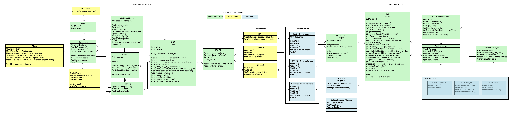

# UDS Communication Documentation for Flashbootloader

This document describes the concept of the UDS communication that is used for this project. Mainly there is only a suitable subset of the UDS protocol implemented so that the bootloader stays as simple as possible. Furthermore this means that adaptions were made if necessary for this project.

## CAN and CAN FD Basics
CAN and CAN FD is used as main communication protocol. There are some further readings found under [CAN FD Wikipedia](https://en.wikipedia.org/wiki/CAN_FD)
and [CAN Bus Wikipedia](https://en.wikipedia.org/wiki/CAN_bus). First of all the communication in general is defined in the following section.

>The identification of the different ECUs and the Flashbootloader GUI is considered as following:
> - The extended frame format with 29 bit identifier is used (0x1FFFFFFF - 0001 1111 1111 1111 1111 1111 1111 1111)
> - The identifier mask is 0x0F24 FFFF - 0 1111 0010 0100 1111 1111 1111 1111
> - The lowest 4 bits are used to identify the GUI where ID 1 is used as standard identifier.
> - There is only 1 GUI instance allowed
> - The identifier of the Flasbootloader GUI broadcast is 0x0F24 0001 (low ID for higher priority) - 1111 0010 0100 0000 0000 0000 0001
> - The range of the identifier of the ECUs is 0xF24 FFF0 - 1111 0010 0100 1111 1111 1111 0000
> - Example for ECU A identifier: 0x0F24 0010 
> - Example for transmitting from GUI to ECU A: 0x0F24 0011 (indicates for ECU A that there is a request from GUI with ID 1)
> - Example for transmitting from ECU A to GUI: 0x0F24 0010 (inidicates for GUI that there is a response from ECU)
  
> For this documentation it is further on assumed that the ECU is identified by ID "0x0F24 0010" and the GUI is identified by ID "0x0F24 0001". To directly address some information to the ECU, the GUI uses the direct communication identifier for the ECU "0x0F24 0011".

**Extended frame format**
| Field name                 | Length (bits) | Purpose                                         |
|----------------------------|---------------|-------------------------------------------------|
| Start-of-frame             | 1             | Denotes the start of frame transmission         |
| Identifier A               | 11            | First part of unique identifier                 |
| Substitute Remote Request  | 1             | Must be recessive (1)                           |
| Identifier extension bit   | 1             | Must be recessive (1) for extended frame format | 
| Identifier B               | 18            | Second part of unique identifier                |
| Remote transmission request| 1             | Must be dominant (0) for data frames            |
| Reserved bits              | 2             | Reserved bits, must be dominant (0)             |
| Data length code (DLC)     | 4             | Number of bytes of data (0-8 bytes)             |
| Data Field                 | 0-64          | Data to be transmitted (0-8 bytes def. by DLC)  |
| CRC                        | 15            | Cyclic redundancy check                         |
| CRC delimiter              | 1             | Must be recessive (1)                           |
| ACK slot                   | 1             | Transmitter sends recessive (1)                 |
| ACK delimiter              | 1             | Must be recessive (1)                           |
| End-of-frame (EOF)         | 7             | Must be recessive (1)                           |
| Inter-frame spacing (IFS)  | 3             | Must be recessive (1)                           |

## Research on UDS
To get a more detailed insight into the UDS protocol the following sources have been used:
- [CSS Electronics - UDS Explained - A Simple Intro (Unified Diagnostic Services)](https://www.csselectronics.com/pages/uds-protocol-tutorial-unified-diagnostic-services)
- [Automotive Softing - UDS ISO 14229](https://automotive.softing.com/fileadmin/sof-files/pdf/de/ae/poster/UDS_Faltposter_softing2016.pdf)
- [Security Alogrithm Example](https://udsoncan.readthedocs.io/en/latest/udsoncan/intro.html)

### CAN ISO-TP 
- For classical CAN frames the maximum payload is 8 bytes, for CAN FD the payload is limited to 64 bytes
- The ISO-TP standard outlines how to communicate CAN data payloads that consists of up to 4095 bytes through segmentation, flow control and reassembly
- The first byte (Data 0) of the CAN message is used as Protocol Control Information (PCI)

- CAN
  - Single Frame (Code = 0): Data 0 (=0x00..0x07) -> Data consists of 0 - 7 bytes of payload
  - First Frame (Code = 1): Data 0+1 (=0x1008..0x1FFF) -> Data consists of initial payload (6 bytes), Size 8-4095
  - Consecutive Frame (Code 2): Data 0 (0x21..0x2F) -> Data consists of 7 byte payload, padding
  - Flow Control Frame (Code 3): Data 0 (0x30..0x32 - Flag), Data 1 (Block size), Data 2 (Separation Time)
    - Data 0 - Flag: 0x00 = Continue to Send, 0x01 Wait, 0x02 Overflow/Abort
    - Data 1 - Block Size: 0x00 = remaining frames without flow control or delay, >0x00 = send number of frames before waiting for next flow control frame
    - Data 2 - Separation time: 0x00 - 0x7F = separation time in milliseconds, 0xF1 - 0xF9 = separation time in even multiples of 100 microseconds

- CAN FD
  - Single Frame (Code = 0): Data 0 (0x0), Data 1 (0x0..0x3E) -> Data consists of 0 - 62 byes of payload
  - First Frame (Code = 1): Data 0 (0x1), Data 1 (0x0), Data 2-5 (4 bytes): 0x0000003C..0xFFFFFFFF -> ~4 GB
  - Consecutive Frame + Flow Control Frame analog to CAN

## Underlaying Software architecture

The main logic for the UDS communication is located in the UDS Layer of the Windows GUI framework on the one side and in the UDS Layer of the MCU. In general the communication can be handled via CAN, CAN FD or Ethernet. The details for the different technologies is not part of the documentation.

## Protocol description for Flashbootloader

> - The programming session is closed if there is no communication for 10 seconds
> - Invalid or unclear messages are not responded by the ECU
> - General structure: [Protocol Control Information][bytes of payload]
>   - The PCI field is not related to UDS itself, but required for UDS requests that are too long for a single frame e.g. on the CAN bus (see ISO-TP)
> - For the positive ack response 0x40 is added to the SID

## Supported Service Overview 

### Diagnostic and Communication Management
| $SID | Available in Default Session | Has Sub-Function | Service Name               | 
|-------------------------------------|------------------------------|------------------|----------------------------|
| $10                                 | &#9745;                      | &#9745;          | Diagnostic Session Control |  
| $11                                 | &#9745;                      | &#9745;          | ECU Reset                  |
| $27                                 |                              | &#9745;          | Security Access            |
| $3E                                 | &#9745;                      | &#9745;          | Tester Present             |

### Data Transmission
| $SID | Available in Default Session | Has Sub-Function | Service Name               | 
|-------------------------------------|------------------------------|------------------|----------------------------|
| $22                                 | &#9745;                      |                  | Read Data By Identifier    |
| $23                                 |                              |                  | Read Memory By Address     |
| $2E                                 |                              | &#9745;          | Write Data By Identifier   |

### Upload | Download
| $SID | Available in Default Session | Has Sub-Function | Service Name               | 
|-------------------------------------|------------------------------|------------------|----------------------------|
| $34                                 |                              |                  | Request Download           |
| $35                                 |                              |                  | Request Upload             |
| $36                                 |                              |                  | Transfer Data              |
| $37                                 |                              |                  | Request Transfer Exit      |

## Supported Common Response Codes

| HEX | Description                                     |
|-----|-------------------------------------------------|
| 10  | General reject                                  |
| 11  | Service not supported                           |
| 12  | Sub-Function not supported                      |
| 13  | Incorrect msg len or invalid format             |
| 14  | Response too long                               |
| 21  | Busy repeat request                             |
| 22  | Conditions not correct                          |
| 24  | Request sequence error                          |
| 26  | Failure prevents execution of requested action  | 
| 31  | Request out of range                            |
| 33  | Security access denied                          |
| 35  | Invalid key                                     |
| 36  | Exceeded number of attempts                     |
| 37  | Required time delay not expired                 |
| 70  | Upload/Download not accepted                    |
| 71  | Transfer data suspended                         |
| 72  | General programming failure                     |
| 73  | Wrong Block Sequence Counter                    |
| 7E  | Sub-Function not supported in active session    |
| 7F  | Service not supported in active session         |

--- 
## Session Handling

> - Programming relevant services (SIDs) are only accessable in programming session.
> - To enable the full access there need to be a security access after changing to programming session

To fully activate the programming session without any restrictions the following procedure need to be done:

> 1. The GUI requests for a seed - Need to be a random value that must be use in order to compute the key
> 2. The GUI computes a key based on the seed using an algorithm that is defined for the AMOS Bootloader and known to GUI and ECU
> 3. The GUI sends the key to the ECU, the ECU verifies it and, if it matches the ECU's value, the programming session is fully unlocked

## Specification for Diagnostic and Communication Management

---

### Diagnostic Session Control (SID 0x10)
> General Request: [PCI][\$SID][Session] -> PCI = Single Frame (Code = 0)
  
#### Default Session
| Type | Bytes |
|---|---|
| Req  - ID: "0x0F24 0011"| [0x00][0x10][0x01] |
| Resp - ID: "0x0F24 0010" | [0x00][0x50][0x01] |

#### Programming Session
| Type | Bytes |
|---|---|
| Req  - ID: "0x0F24 0011"| [0x00][0x10][0x02] |
| Resp - ID: "0x0F24 0010" | [0x00][0x50][0x02] |

#### Wrong/Unavailable Session
| Type | Bytes |
|---|---|
| Req  - ID: "0x0F24 0011"| [0x00][0x10][0x04] |
| Resp - ID: "0x0F24 0010" | [0x00][0x7F][0x10][0x31] |

---

### ECU Reset (SID 0x11)
> General Request: [PCI][\$SID][Reset Type] -> PCI = Single Frame (Code = 0)

> The supported reset types need to be defined -> TODO

#### PowerOn Reset
| Type | Bytes |
|---|---|
| Req  - ID: "0x0F24 0011"| [0x00][0x11][0x01] |
| Resp - ID: "0x0F24 0010" | [0x00][0x51][0x01] |

#### Cold PowerOn Reset
| Type | Bytes |
|---|---|
| Req  - ID: "0x0F24 0011"| [0x00][0x11][0x02] |
| Resp - ID: "0x0F24 0010" | [0x00][0x51][0x02] |

#### Warm PowerOn Reset
| Type | Bytes |
|---|---|
| Req  - ID: "0x0F24 0011"| [0x00][0x11][0x03] |
| Resp - ID: "0x0F24 0010" | [0x00][0x51][0x03] |

| Type | Bytes |
|---|---|
| Req  - ID: "0x0F24 0011"| [0x00][0x11][0x04] |
| Resp - ID: "0x0F24 0010" | [0x00][0x7F][0x11][0x31] |

--- 

### Security Access (SID 0x27)
> General Request: [PCI][\$SID]\[Request Type\](\[KEY\]) -> PCI = Single Frame (Code = 0)

#### Default Session
| Type | Bytes |
|---|---|
| Req  - ID: "0x0F24 0011"| [0x00][0x27][0x01] |
| Resp - ID: "0x0F24 0010" | [0x00][0x7F][0x27][0x7F] |

#### Programming Session
##### Request SEED
| Type | Bytes |
|---|---|
| Req  - ID: "0x0F24 0011"| [0x00][0x27][0x01] |
| Resp - ID: "0x0F24 0010" | [0x00][0x67][0x01][0x..][0x..].. |

##### Verify Key + Access Granted
| Type | Bytes |
|---|---|
| Req  - ID: "0x0F24 0011"| [0x00][0x27][0x02][0x..][0x..].. |
| Resp - ID: "0x0F24 0010" | [0x00][0x67][0x02] |

##### Verify Key + Access Denied -> Invalid Key
| Type | Bytes |
|---|---|
| Req  - ID: "0x0F24 0011"| [0x00][0x27][0x02][0x..][0x..].. |
| Resp - ID: "0x0F24 0010" | [0x00][0x7F][0x27][0x35] |

--- 

### Tester Present (0x3E)

#### Request with Response
| Type | Bytes |
|---|---|
| Req  - ID: "0x0F24 0011"| [0x00][0x3E][0x01] |
| Resp - ID: "0x0F24 0010" | [0x00][0x7E][0x01] |

#### Request without Response
| Type | Bytes |
|---|---|
| Req  - ID: "0x0F24 0011"| [0x00][0x3E][0x02] |

---

