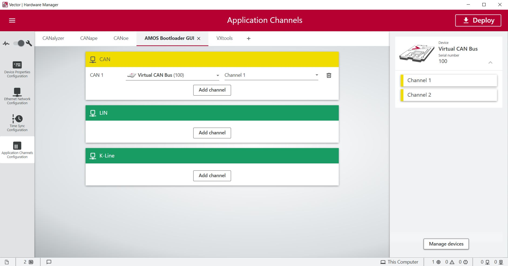

## CAN Wrapper

This CAN Wrapper is written to adapt to the AMOS Flashbootloader Framework. It uses the Vector XL Driver library, which comes with the files vxlapi.h, vxlapi.dll, vxlapi64.dll, vxlapi.lib and vxlapi64.lib. All of these mentioned files are necessary to compile this project and run the executeable.

### Installation
To use the Vector XL Driver library it first need to be installed. Please follow the installation instructions of the [Vector website](https://www.vector.com/us/en/products/products-a-z/libraries-drivers/xl-driver-library/). The installed files need to be used as described below.

### Development
For development the following steps need to be done to do the correct linking of the library. MinGW was used as compiler.

Using Eclipse CDT:
1. Go into Project Properties --> C/C++ Build/Settings
2. Under MinGW C++ Linker / Libraries --> Library Search Path (-L): Add the directory to where the .lib files are located for XL driver lib
   - Use the following path: "\${workspace_loc:/\${ProjName}/src/lib}"
3. Under MinGW C++ Linker / Libraries --> Libraries (-l): List all the .lib files (do not include the .dll/.lib ending)
   - vxlapi
   - vxlapi64
4. Do Project --> Clean
5. Project --> Build All

### Application

To start the application:
1. Put the dll files in the same folder as the application executable

### Usage
To communicate via Virtual CAN bus or real Vector hardware over the CAN Wrapper, it first need to be linked via the Vector Hardware Manager. After the first start of the CAN Wrapper the "AMOS Bootloader GUI" is registered so it can be configured via the Vector Hardware Manager.

After the first configuration, the CAN Wrapper uses the assign CAN 1 interface to send and receive CAN messages.