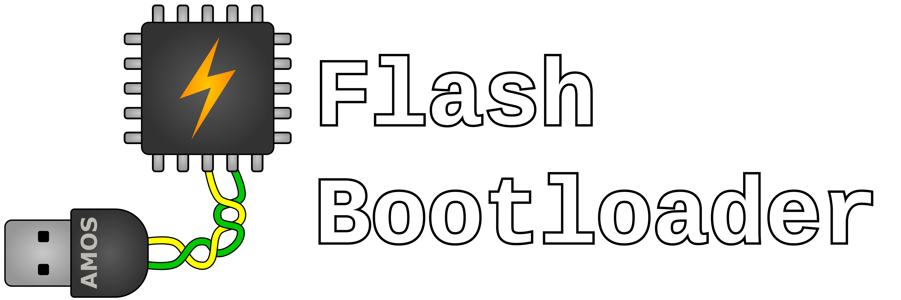

<h1 align="center">
  
</h1>

# Updating Flash Bootloader

## Project Description
The goal of this project is to develop a Flash Boot Loader (FBL) for an embedded device. The FBL can update the application software on the embedded device with a new software. In addition, a GUI is developed to be used on Windows PC. With this GUI the new application software can be transferred to the FBL.

The AURIX&trade; TC375 lite kit was used for development. It is equipped with a 32-Bit Single-Chip AURIX&trade; TriCore&trade; based-Microcontroller. For further information check out the [website](https://www.infineon.com/cms/en/product/evaluation-boards/kit_a2g_tc375_lite/).

## Getting Started 
### AURIX&trade; TC375 lite kit
* Installation of [Aurix Development Studio](https://www.infineon.com/cms/en/product/promopages/aurix-development-studio/)

### Flash GUI
* Installation of [QT 6.8.0 Open Source](https://www.qt.io/download-qt-installer-oss) with MSVC2019 64 and cmake. Under LGPLv3 license which content can be accessed in the LGPLv3 file.
* Install MSVC2022 (remember to add the compiler to the system variable PATH) and Microsoft SDK using e.g. [Visual Studio](https://visualstudio.microsoft.com/) 
* Install [cmake](https://cmake.org/)

### Documentation
Further details can be found under [Documentation](./Documentation).

## Using Flash Bootloader Tool
You can start the application by pressing "run_GUI".
* TBD

## FAQ
* TBD

## Licenses

<!--- TODO Vector in table -->

This project is licensed under the MIT License.
It includes several libraries that are licensed using different Licenses.

| License | Files | Origin | License Text |
|---------|-------|--------|--------------|
| Boost Software License Version 1.0 | [Aurix Libraries](MCU_Aurix/Libraries), [Aurix Configuration](MCU_Aurix/Configuration), [Aurix Tasking Linker Script](MCU_Aurix/Lcf_Tasking_Tricore_Tc.lsl), [Aurix Alternative Linker Script](MCU_Aurix/Lcf_Gnuc_Tricore_Tc.lsl), [Aurix main files](MCU_Aurix/main) | Generated by the AURIX IDE | Contained in file header |
| GNU LGPL | Qt*.dll files and qwindows.dll | [QT](https://www.qt.io/download) | [LGPL V3](LGPLv3.txt) |
| Copyright (c) 2020 by Vector Informatik GmbH | [vxlapi.h](_Snippets/GUI/CAN_Wrapper/src/lib/vxlapi.h) | [Vector XL driver library](https://www.vector.com/de/de/download/vector-driver-setup-windows-10-und-11/) | No license text |
| MIT | All Files not contained by previous licenses. Contain MIT license declaration in the file header. | Implemented by our team. | [MIT License](LICENSE) |

## Contributors

